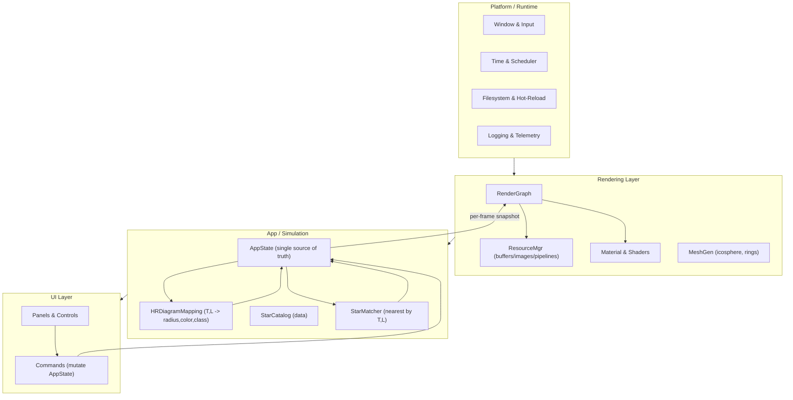

# ADR 0001: Layered Architecture
Date: 2025-08-18
Status: Proposed

## Context
We need a clear architecture for star visualizer that:
- Maps Hertzprung-Russel parameters to visual apperance.
- Compares against a real-star catalog.
- Renders toon-shaded stars in a 3D environment.
We aim to minimal coupling, shader hot-reload and testable domain logic.

## Decision
- Adopt a **layered architecture** with a single source of truth for app state.
- Use a **render graph** to orchestrate GPU passes and resources.
- Keep **domain logic** independent of rendering.
- Manage GPU resources via **resource manager** with handles and RAII.

## Architecture
