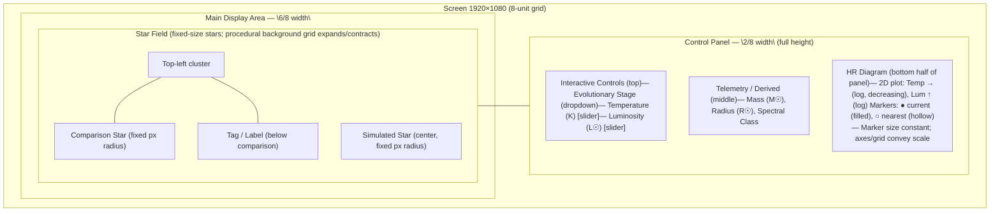

# Stardust Crusadiers - UI specification

**Owner:** `ariargenta`
**Version:** `0.1.0`
**Status:** `Draft`
**Last updated:** `2025-08-19`

---

## 1. Purpose
- Users adjust **Temperature (K)** and **Luminosity (L☉)** and immediately **see** star **color** and **scale perception** change.
- Users **compare** against the **nearest catalogued star** at **true scale**, perceived via background expansion.
- UI exposes only the **minimum controls** required to support the above.
- Users can view the **position of the current star on the HR diagram** to understand its classification.

---

## 2. Screen layout

---

## 3. Component registry
| ID | Role | Type | Input/Output | Data binding | Notes |
|------|------|------|------|------|------|
| `ctrl.temp` | Temperature | slider | input: `K` | `AppState.params.temperatureK` | Range 2.5k–40k |
| `ctrl.lum` | Luminosity | slider | input: `L☉` | `AppState.params.luminosityLsol` | Range 1e-4–1e6 |
| `ctrl.mass` | Mass | slider | input: `M☉` | `AppState.params.mass` | Derived stage |
| `ctrl.stage` | Evolutionary stage | dropdown | input | `AppState.params.stage` | Main sequence, giant, dwarf |
| `view.star.main` | Main star | canvas | output | `AppState.derived` | Fixed pixel radius |
| `view.star.compare` | Compare star | canvas | output | `AppState.selection.nearest` | Fixed radius, proportional |
| `bg.hrgrid` | Background grid | procedural canvas | output | recomputes scale factor | Expands/contracts |
| `info.telemetry` | Panel | output | shows T, L, R, M, class | Updated dynamically |

---

## 4. Controls - Ranges, Steps, Defaults
- **Temperature (`ctrl.temp`)**
    - Unit: Kelvin (K)
    - Range: 2500 -> 40000
    - Step: 50
    - Default: 5 777 (Sun)

- **Luminosity (`ctrl.lum`)**
    - Unit: Solar luminosity (L☉)
    - Range: 0.0001 -> 1000000
    - Step: 1% of current value
    - Default: 1.0 (Sun)

- **Mass (`ctrl.mass`)**
    - Unit: Solar mass (M☉)
    - Range: 0.1 -> 100
    - Step: 0.1
    - Default 1.0 (Sun)

---

## 5. Visual mapping and rendering frame rule
### 5.1 Color ramp
- cel-shaded bins by temperature:
    - `< 3300 K` = Red
    - `3300 - 5000` = Orange
    - `5000 - 6500` = Yellow
    - `6500 - 10000` = White
    - `> 10000` = Blue

---

### 5.2 Scale and camera movement
- **Principle:** Stars remain **constant anchors**; background conveys scale.
- **Implementation:**
    - Main star and compare star keep fixed radius in pixels.
    - **Background HR grid** expands/contracts procedurally to emulate star growth/shrinkage.
    - User perceives scale through **changing density of the grid**.
    - **Scale badge** indicates real size: \[1~\text{px} \;\equiv\; X \, R_\odot\]

---

## 6. States and behaviours
### 6.1 States
- **S0 Initial:** Deaults (Sun), comparison shown.
- **S1 Adjusting:** Slider changes cause background grid to move.
- **S2 Snap:** Nearest catalog star pulses for 2 seconds.
- **S3 Compare:** Secondary star hidden.
- **S4 Overlay:** HR diagram visible; markers move with parameters.

### 6.2 Event -> Effect
| Event | Effect |
|------|------|
| `input.change(temp/lum/mass/stage)` | Stars fixed size; background grid expands/contracts; telemetry updates. |
| `click.snap` | Nearest star selected; hollow marker highlighted. |
| `toggle.compare` | Show/hide compare star + info tag. |

---

